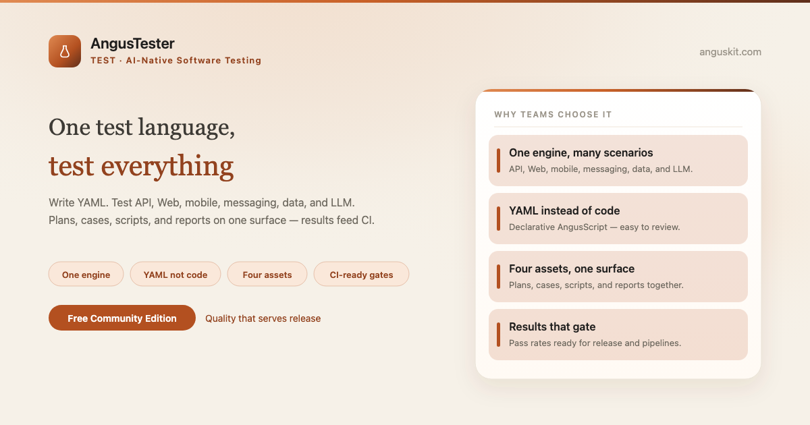
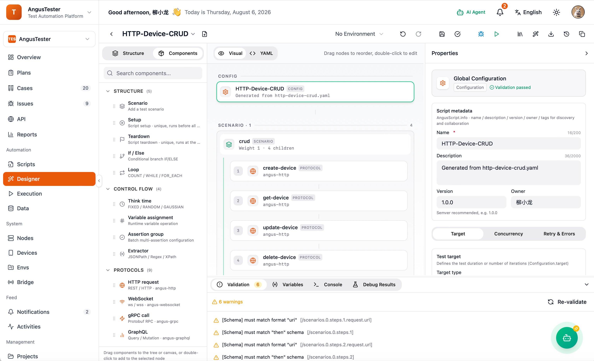

**English** | [简体中文](README.zh.md)

<p align="center">
  
</p>

<p align="center">
  <a href="https://www.anguskit.com/en/pricing"></a>
  <a href="LICENSE"></a>
  <a href="https://www.anguskit.com/en/docs/tester"></a>
  <a href="https://www.anguskit.com"></a>
</p>

# AngusTester

**One Test Language. Test Everything.**

AI-Native Software Testing — the Test product in [AngusKit](https://github.com/AngusKit/AngusKit).

> **This repository hosts documentation only.** AngusTester source code is distributed through private deployment packages, not through this GitHub repository. Earlier revisions of this repository contained application source; as of this update, distribution has moved to AngusKit's packaging pipeline (see [Get the Community Edition](#get-the-community-edition-free) below). This repository now focuses on product information, quickstart guides, and links to the full documentation site.

## What is AngusTester

AngusTester replaces tool sprawl and code-script barriers with one declarative test language — **AngusScript YAML** — that runs API, Web, mobile, messaging, data, and LLM tests through a single engine. Test assets (plans, cases, scripts, reports) live on one collaborative surface, and automated runs feed results straight into release decisions.

## Key capabilities

- **One engine, many scenarios** — API, Web, mobile, messaging, data, and LLM tests on a single execution model
- **YAML instead of code** — declare requests, assertions, and extractors in AngusScript; no Java/JS/Python scripting required
- **Plan · case · script · report** — one path from scoping to writing cases to attaching scripts to shipping reports
- **Test plugin extensions** — protocol / Web / mobile / LLM plugins plug into the same engine
- **One-click automation** — run smoke and regression suites across environments, reproducible and CI-ready
- **Performance testing** — multi-thread concurrency and ramp-up load with SLA threshold checks and live metrics

## Screenshot

<p align="center">
  
</p>

## Get the Community Edition (free)

```bash
curl -LO https://repo.anguskit.com/raw/raw-public/AngusKit/tester/AngusTester-Community-2.0.0.zip
unzip AngusTester-Community-2.0.0.zip
cd AngusTester-2.0.0/docker
cp env.example .env
docker compose --profile mysql up -d
```

- Minimum: **2 cores / 4 GB** (recommended: 4 cores / 8 GB); disk 40 GB plus execution logs and plugins
- Ports after install: AngusGM `8801` (sign-in), AngusTester `8807`
- The server itself does not execute scripts — attach at least one execution node (Agent) before jobs run
- Only need AngusTester? This zip includes AngusTester + AngusGM — no other product required.

Full installation guide (host ZIP, Kubernetes/Helm, TLS, upgrades, execution nodes): **[docs.anguskit.com/tester](https://www.anguskit.com/en/docs/tester/latest/en/manual/02-install-deploy)**

## Community vs. Team / Enterprise vs. SaaS

| | Community | Team / Enterprise | SaaS |
|---|---|---|---|
| Price | Free | Paid, private deployment | Paid, hosted |
| Users | Up to 10 | Higher / unlimited seats | Per plan |
| Test projects | Up to 20 | Higher / unlimited | Per plan |
| Test concurrency | Up to 1,000 | Higher / unlimited | Per plan |
| Web / mobile / messaging / LLM plugins, report gating, Testing Copilot, MCP | Not included (API + basic performance only) | Included | Per plan |

Community Edition source is licensed under GPL-3.0 and distributed with each Community installation package. Team and Enterprise editions are proprietary, governed by the **XCan Business License, Version 1.0**, distributed only under a paid subscription.

Full pricing and feature comparison: **[anguskit.com/pricing](https://www.anguskit.com/en/pricing)**

## Related AngusKit products

| Product | Focus | Repository |
|---|---|---|
| AngusKit | The full suite (this product + 5 others + AngusGM) | [AngusKit/AngusKit](https://github.com/AngusKit/AngusKit) |
| AngusAI | AI agent development | [AngusKit/AngusAI](https://github.com/AngusKit/AngusAI) |
| AngusGit | AI-native code collaboration | [AngusKit/AngusGit](https://github.com/AngusKit/AngusGit) |
| AngusRepo | Universal artifact management | [AngusKit/AngusRepo](https://github.com/AngusKit/AngusRepo) |
| AngusSecurity | Application security & governance | [AngusKit/AngusSecurity](https://github.com/AngusKit/AngusSecurity) |
| AngusInsight | Private product analytics | [AngusKit/AngusInsight](https://github.com/AngusKit/AngusInsight) |

## Documentation & support

- Full docs: [anguskit.com/docs/tester](https://www.anguskit.com/en/docs/tester)
- Contact / sales: [anguskit.com/contact](https://www.anguskit.com/en/contact) · `sales@anguskit.com`
- This repository's Issues are for **documentation feedback and install troubleshooting**. This repository does not accept source code pull requests — see [CONTRIBUTING.md](CONTRIBUTING.md).

## License

- This repository's documentation content: see [LICENSE](LICENSE) (GPL-3.0, matching the Community Edition source it describes).
- AngusTester Community Edition product source: GPL-3.0, distributed with each Community installation package.
- AngusTester Team / Enterprise Edition: proprietary, XCan Business License v1.0, distributed under a paid subscription only.
