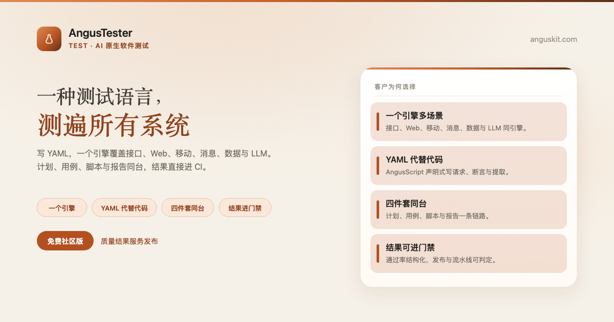
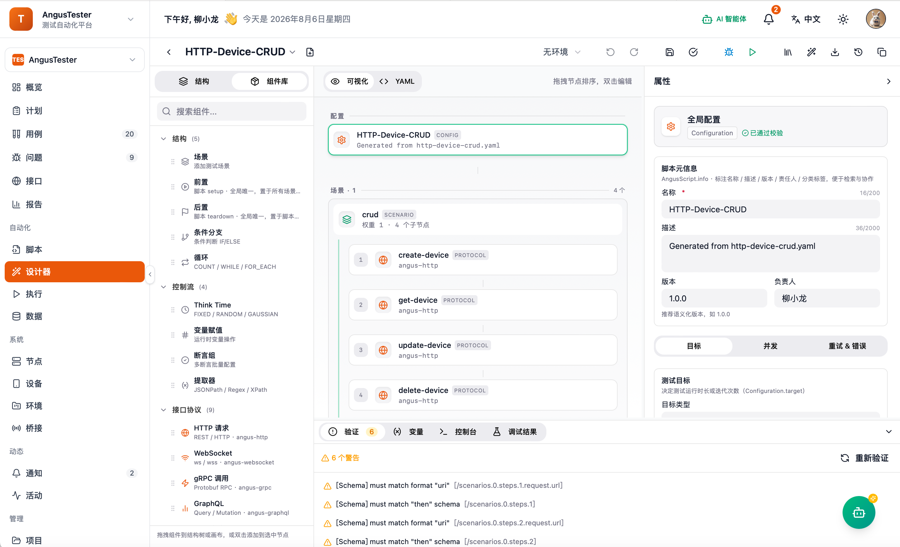

[English](README.md) | **简体中文**

<p align="center">
  
</p>

<p align="center">
  <a href="https://www.anguskit.com/zh/pricing"></a>
  <a href="LICENSE"></a>
  <a href="https://www.anguskit.com/zh/docs/tester"></a>
  <a href="https://www.anguskit.com"></a>
</p>

# AngusTester

**一种测试语言，测遍所有系统。**

AI 原生软件测试——[AngusKit](https://github.com/AngusKit/AngusKit) 中负责 Test 的产品。

> **本仓库仅承载文档内容。** AngusTester 的产品源码通过私有化安装包分发，不在本 GitHub 仓库公开。本仓库此前版本曾包含应用源码；本次更新后，源码分发已统一收拢到 AngusKit 的打包发布流水线（见下文「免费获取社区版」）。本仓库现聚焦于产品信息、快速上手指引，以及指向完整文档站的链接。

## AngusTester 是什么

AngusTester 用一种声明式测试语言——**AngusScript YAML**——替代多工具拼装与代码脚本门槛，一个引擎跑通接口、Web、移动、消息、数据与 LLM 等测试场景。计划、用例、脚本与报告收在同一协作面上，自动化执行结果直接服务发布决策。

## 核心能力

- **一个引擎多场景**——接口、Web、移动、消息、数据与 LLM 测试统一执行模型
- **YAML 代替代码**——用 AngusScript 声明请求、断言与提取，无需 Java/JS/Python 脚本
- **计划·用例·脚本·报告**——从定范围到写用例、挂脚本、出报告一条链路
- **测试插件扩展**——协议/Web/移动/LLM 插件即插即用，同一引擎扩展更多场景
- **自动化一键执行**——跨环境跑通冒烟与回归，结果可复现、可进 CI
- **性能与压测**——多线程并发与梯度加压，SLA 阈值判定与实时指标

## 产品截图

<p align="center">
  
</p>

## 免费获取社区版

约 **290 MB**。本安装包是 **AngusGM + AngusTester**。 至少 **2 核 / 4 GB** 内存、**40 GB** 磁盘（执行日志与插件另计）。需 Docker Engine 与 Compose v2。

本页路径与官网文档一致：Docker Compose、安装向导、**访问方式 2**（捆绑 Caddy）、HTTP `:80`（无证书）。

1. 先把域名解析到本机（本机试用可写入 `/etc/hosts`）。向导里的 Public DNS name 填**后缀**（如 `example.com`），不要填 `gm.example.com`。

```bash
127.0.0.1 gm.example.com tester.example.com
```

放行宿主机 **80**。要执行脚本时再放行 **7100**。不要用 `localhost:8801`。本机已有 Nginx/Caddy/IIS 占用 80 时先停掉。macOS + Docker Desktop 不要给 `./install.sh` 加 `sudo`。

2. 下载、解压，在包根目录跑向导：

```bash
curl --fail --location --progress-bar -o AngusTester-Community-2.0.0.zip \
  https://repo.anguskit.com/raw/raw-public/AngusKit/tester/AngusTester-Community-2.0.0.zip
unzip AngusTester-Community-2.0.0.zip
cd AngusTester-2.0.0
./install.sh
```

按提示：Install mode `1`（Compose）→ Access **`2`**（捆绑反代，不要回车）→ Proxy `1`（Caddy）→ TLS **`4`**（HTTP `:80`，无证书）→ Database `1`（Compose 内 MySQL 8）→ Public DNS name = `example.com` → 设置管理员密码（默认用户 `admin`）。等到终端出现 `Install finished.`。

3. 确认健康后再打开控制台：

```bash
./bin/angusctl.sh doctor
```

输出包含 `doctor: OK`。打开 `http://gm.example.com/` 登录，再打开 `http://tester.example.com/`。

需要一次装齐？用 [AngusKit](https://github.com/AngusKit/AngusKit) 的 `AngusKit-Community-1.0.0.zip`。

第一次跑通：**[tester 快速开始](https://www.anguskit.com/zh/docs/tester/get-started/quickstart)** · 完整安装（主机 ZIP、Helm 预览、TLS、离线）：**[安装文档](https://www.anguskit.com/zh/docs/tester/latest/zh/manual/02-install-deploy)**

## 社区版 vs 团队版/企业版 vs SaaS

| | 社区版 | 团队版/企业版 | SaaS |
|---|---|---|---|
| 价格 | 免费 | 付费，私有化部署 | 付费，云端托管 |
| 用户数 | 最多 10 | 更高/不限席位 | 按套餐 |
| 测试项目数 | 最多 20 | 更高/不限 | 按套餐 |
| 测试并发数 | 最多 1,000 | 更高/不限 | 按套餐 |
| Web/移动/消息/LLM 插件、报告门禁、Testing Copilot、MCP | 不含（仅接口测试与基础性能） | 包含 | 按套餐 |

社区版源码使用 GPL-3.0 协议，随社区版安装包一同分发。团队版与企业版为专有软件，受 **[XCan Business License, Version 1.0](https://www.anguskit.com/licenses/XCBL-1.0)**（XCBL-1.0）约束，仅随付费订阅提供。

完整定价与功能对照：**[anguskit.com/pricing](https://www.anguskit.com/zh/pricing)**

## AngusKit 关联产品

| 产品 | 定位 | 仓库 |
|---|---|---|
| AngusKit | 完整套件（本产品 + 其它 5 个 + AngusGM） | [AngusKit/AngusKit](https://github.com/AngusKit/AngusKit) |
| AngusAI | AI 智能体开发 | [AngusKit/AngusAI](https://github.com/AngusKit/AngusAI) |
| AngusGit | AI 原生代码协作 | [AngusKit/AngusGit](https://github.com/AngusKit/AngusGit) |
| AngusRepo | 通用制品管理 | [AngusKit/AngusRepo](https://github.com/AngusKit/AngusRepo) |
| AngusSecurity | 应用安全与治理 | [AngusKit/AngusSecurity](https://github.com/AngusKit/AngusSecurity) |
| AngusInsight | 私有化产品分析 | [AngusKit/AngusInsight](https://github.com/AngusKit/AngusInsight) |

## 文档与支持

- 完整文档：[anguskit.com/docs/tester](https://www.anguskit.com/zh/docs/tester)
- 联系/销售：[anguskit.com/contact](https://www.anguskit.com/zh/contact) · `sales@anguskit.com`
- 本仓库的 Issues 仅用于**文档反馈与安装排查**。本仓库不接受源码 Pull Request，详见 [CONTRIBUTING.md](CONTRIBUTING.md)。

## License

- 本仓库文档内容：见 [LICENSE](LICENSE)（GPL-3.0，与其描述的社区版源码保持一致）。
- AngusTester 社区版产品源码：GPL-3.0，随每个社区版安装包分发。
- AngusTester 团队版/企业版：专有软件，[XCan Business License, Version 1.0](LICENSE-XCBL-1.0)（XCBL-1.0）— 详见 https://www.anguskit.com/licenses/XCBL-1.0，仅随付费订阅提供。
